  

  

  

  

 

<table>
<tr>
<td width="52%" valign="top">

## ⚡ What I build

**Web Apps & Software**  
Clean, fast digital products and systems designed around usability, performance and long-term maintainability.

**CMS & Content Systems**  
Practical publishing setups and workflows that make managing and scaling content easier.

**SEO & Organic Growth**  
Technical foundations, structure and content systems built to improve discoverability and sustainable search growth.

**Digital Marketing & Brand Systems**  
Connected digital experiences where product, content, visibility and brand all reinforce each other.

</td>
<td width="48%" valign="middle" align="center">

</td>
</tr>
</table>

 

## 🧩 WordPress Plugin Lab

  

 

  

### Plugin #001 — TZYRED Product Cleaner

**WooCommerce catalog cleanup without blind bulk actions.**  
Version **2.0.0** adds exact product/image searching, visual previews, controlled batch cleanup, pause/resume, CSV export, saved searches and workspace branding.

<table>
<tr>
<td width="25%" align="center"><strong>🔎 Exact Search</strong> Product name, product URL, image filename, image URL & missing-image checks.</td>
<td width="25%" align="center"><strong>🖼️ Visual Review</strong> Thumbnails, SKU, status, image IDs and exact match reasons before action.</td>
<td width="25%" align="center"><strong>🛡️ Safer Cleanup</strong> Trash-first workflow, re-checks before removal, pause/resume and guarded permanent delete.</td>
<td width="25%" align="center"><strong>⚙️ Reusable Tooling</strong> Saved presets, CSV export, branded workspace and no external API dependency.</td>
</tr>
</table>

  
  
  
  
  

> **Lab rule:** every useful WordPress plugin we build gets a numbered spot here — with the problem it solves, current version, compatibility, release status and repository link once published.

### 🖤 TZYRED AI focus

 

> **Clean enough to trust. Fast enough to use. Structured enough to scale. Discoverable enough to grow.**

I build where **product + systems + content + search + brand** meet. The goal is not just to make something look good — it should work cleanly, communicate clearly and create measurable digital momentum.

## 📡 GitHub signals

  
  

 

<picture>
  <source media="(prefers-color-scheme: dark)" srcset="https://raw.githubusercontent.com/tzyredai/tzyredai/output/github-contribution-grid-snake-dark.svg" />
  <source media="(prefers-color-scheme: light)" srcset="https://raw.githubusercontent.com/tzyredai/tzyredai/output/github-contribution-grid-snake.svg" />
  
</picture>

 

  
    
  <strong>TZYRED AI 🖤</strong> 
  Smart brands. Clean systems. Digital growth.

