  

  

  <h1>TZYRED AI 🖤</h1>
  
<strong>Web Apps • SEO • Digital Marketing • CMS • Software Dev</strong>

  
Building smart brands, clean systems & digital growth. 🖤

What I build
<table>
  <tr>
    <td width="50%" valign="top">
      <h3>⚡ Web & Software</h3>
      
Clean digital products, web applications and software systems built around performance, usability and long-term maintainability.

    </td>
    <td width="50%" valign="top">
      <h3>🧠 CMS & Systems</h3>
      
Practical content systems and CMS workflows that make publishing, managing and scaling a brand easier.

    </td>
  </tr>
  <tr>
    <td width="50%" valign="top">
      <h3>📈 SEO & Growth</h3>
      
Search-focused structure, technical foundations and content systems designed to improve discoverability and sustainable organic growth.

    </td>
    <td width="50%" valign="top">
      <h3>🖤 Digital Brand Building</h3>
      
Digital marketing and brand systems that connect product, content and growth into one clear online presence.

    </td>
  </tr>
</table>

Focus

  
  
  
  
  

Build philosophy
Clean enough to trust. Fast enough to use. Structured enough to scale. Discoverable enough to grow.

I like digital work where the pieces support each other: a strong product, a clean technical foundation, useful content, solid search visibility and a brand that feels intentional.
GitHub activity

  
  

<picture>
  <source media="(prefers-color-scheme: dark)" srcset="https://raw.githubusercontent.com/tzyredai/tzyredai/output/github-contribution-grid-snake-dark.svg" />
  <source media="(prefers-color-scheme: light)" srcset="https://raw.githubusercontent.com/tzyredai/tzyredai/output/github-contribution-grid-snake.svg" />
  
</picture>

  Smart brands. Clean systems. Digital growth. 🖤

